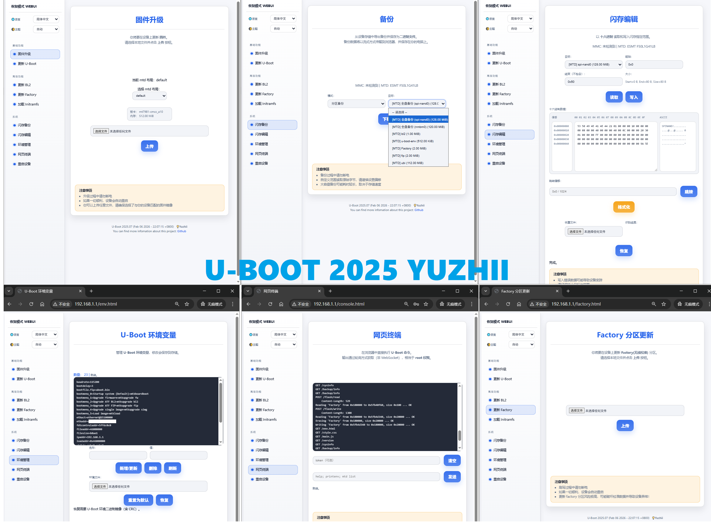

# 适用于 mt798x 的 ATF 和 u-boot（带 DHCPD 支持）

由 Yuzhii 修改的 hanwckf 版 MT798x U-Boot，增加了 DHCPD，Web UI由dailook再次修改

**警告：刷入自定义引导加载程序可能导致设备变砖。请谨慎操作，风险自负。**

## 关于 bl-mt798x

U-Boot 2025 新增更多功能：

- 系统信息显示
- 出厂（射频）固件更新
- 备份下载
- 闪存编辑器
- Web 终端
- 环境变量管理器
- 主题管理器
- 国际化（I18N）支持
- 设备重启



你可以根据需要配置功能。

- [x] MTK_DHCPD
  - [x] MTK_DHCPD_ENHANCED
  - [x] MTK_DHCPD_USE_CONFIG_IP
  - MTK_DHCPD_POOL_START_HOST 默认 100
  - MTK_DHCPD_POOL_SIZE 默认 101
- 安全模式 Web UI 样式：
  - [x] WEBUI_FAILSAFE_UI_NEW
    - [x] WEBUI_FAILSAFE_I18N
  - [ ] WEBUI_FAILSAFE_UI_GL
  - [ ] WEBUI_FAILSAFE_UI_MTK
- [x] WEBUI_FAILSAFE_ADVANCED - 启用高级功能
  - [ ] WEBUI_FAILSAFE_SIMG - 启用单镜像升级
  - [x] WEBUI_FAILSAFE_FACTORY - 启用出厂（射频）固件更新
  - [x] WEBUI_FAILSAFE_BACKUP - 启用备份下载
  - [x] WEBUI_FAILSAFE_ENV - 启用环境变量管理器
  - [x] WEBUI_FAILSAFE_CONSOLE - 启用 Web 终端
  - [x] WEBUI_FAILSAFE_FLASH - 启用闪存编辑器

## 准备工作

```bash
sudo apt install gcc-aarch64-linux-gnu build-essential flex bison libssl-dev device-tree-compiler qemu-user-static
```

> 如需为 arm v7l 设备构建，还需要安装 `gcc-arm-linux-gnueabi`

## 构建

示例：

```bash
chmod +x build.sh
# mt7981，emmc 设备
BOARD=sn_r1 ./build.sh
# mt7981，spi-nand 设备，nonmbm 设备
BOARD=zbt_z8103ax-c VARIANT=NONMBM ./build.sh
# mt7981，spi-nand 设备，多布局设备
BOARD=cmcc_a10 VERSION=SP2 MULTI_LAYOUT=1 ./build.sh
# mt7986，spi-nand 设备，多布局设备，支持单镜像升级
BOARD=ruijie_rg-x60-new VERSION=SP1 MULTI_LAYOUT=1 SIMG=1 ./build.sh
```

- 版本（默认：2025。可选，用于不同版本的 ATF 和 U-Boot）

| 版本 | ATF | UBOOT |
| --- | --- | --- |
| 2025 | 20250711 | 20250711 |
| SP1 | 20241017-bacca82a8 | 20250711 |
| SP2 | 20260123 | 20250711 |

> SP1：部分设备仍使用内核 5.4 固件，在 2025 版本上可能出现问题（如 hwrng 错误），此时可尝试 SP1。
>
> SP2：针对新平台（如 mt7987）或最新内核做了修改，兼容性更好。

- VARIANT（默认：default。可选，用于不同的固件变体）

> 通常，`VARIANT` 是为 MTD 设备准备的。

| 变体 | 说明 | 适用固件 |
| --- | --- | --- |
| default | 推荐用于原厂/自定义分区布局的设备，启用 MTK-NMBM，适合大多数用户 | 原厂/自定义布局固件 |
| nonmbm | 推荐用于原厂/自定义分区布局的设备，禁用 MTK-NMBM | 不带 MTK-NMBM 的原厂/自定义布局固件 |
| ubootmod | 针对 OpenWrt/ImmortalWrt 固件做了修改，兼容性更好 | ubi/ubootmod 布局固件 |
| openwrt | 来自 OpenWrt 官方仓库，暂时不支持安全模式 Web UI | OpenWrt 官方固件 |

---

其他选项：

| 选项 | 类型 | 必填 | 默认值 | 说明 |
| --- | --- | --- | --- | --- |
| SOC | 字符串 | 否 | null | 自动检测，可设置为 SOC=mt7981、SOC=mt7986 或其他 mt798x 平台 |
| MULTI_LAYOUT | 布尔值 | 否 | 0 | 设置 MULTI_LAYOUT=1 可启用多布局支持（仅适用于 nand 设备） |
| FIXED_MTDPARTS | 布尔值 | 否 | 1 | 设置 FIXED_MTDPARTS=0 可使 mtdparts 可编辑，但如果你不了解相关操作可能会导致问题，因此默认设置为 1 以使用固定的 mtdparts（仅适用于 nand 设备） |
| FSTHEME | 字符串 | 否 | new | 可设置 FSTHEME=new/gl/mtk 来更改安全模式 Web UI 主题 |
| SIMG | 布尔值 | 否 | null | SIMG=1 表示在安全模式 Web UI 中启用单镜像升级支持，但如果你不了解相关操作可能会导致问题，因此默认设置为 0 以禁用 |
| CLEAN | 布尔值 | 否 | null | 设置 CLEAN=1 可在构建前清理构建环境 |

> 不能同时启用 MULTI_LAYOUT=1 和 FIXED_MTDPARTS=0

生成的文件将位于 `output` 目录中。

## 使用 Actions 构建

你需要先将此仓库 fork 到你自己的账户，然后就可以使用 Actions 来构建二进制文件，生成的文件将在 `artifacts` 或 `releases` 页面中。

- [x] 构建 FIP
  - [x] 单板/全部/全部-mt798x
  - [x] 版本 2022/2023/2024/2025/2026/SP1/SP2/全部
  - [ ] VARIANT
  - [ ] 额外选项
  > VERSION:all 仅适用于单板
- [x] 构建 GPT
  - [x] 官方布局
  - [ ] 自定义布局
- [x] 构建 BL2
  - [x] RAMBOOT
  - [ ] 超频配置

> 如需构建旧版本（<2025），可切换到 "old-version" 分支
>
> 版本 2026 需要切换到 "mtksoc-20260123" 分支

## 使用 python2.7 生成 GPT

> 安装依赖

```bash
sudo apt-get install python2 python2-dev
```

> 运行

```bash
chmod +x generate_gpt.sh
./generate_gpt.sh
```

生成的文件将位于 `output_gpt` 目录中。

> 你需要在 "mt798x_gpt" 目录中添加你设备的分区信息 JSON 文件，例如 "atf-dir/tools/dev/gpt_editor/example/gpt.json"。

当你启用 `SDMMC=1` 时（例如 `SDMMC=1 ./generate_gpt.sh`），生成的 GPT 镜像将支持 MTK SDMMC。

### 查看 GPT 信息

在仓库根目录下创建一个名为 `mt798x_gpt_bin` 的目录，并将你的 GPT bin 文件放入其中。

然后运行：

```bash
SHOW=1 ./generate_gpt.sh
```

然后它会显示 `mt798x_gpt_bin` 目录中所有 GPT bin 文件的分区信息，并将结果输出到 `output_gpt` 目录中的 `gpt_info.txt`。

### 绘制 GPT 布局

安装 `Pillow` 库：

```bash
pip3 install Pillow
```

然后运行：

```bash
DRAW=1 ./generate_gpt.sh
```

## 编译 ATF

```bash
chmod +x compile_atf.sh
./compile_atf.sh
```

然后会在 `output` 目录中生成 BL2。通常情况下，它会生成 ramboot BL2。

### 超频配置

调整 ARMPLL 频率是一项**非常危险**的操作。

**如果你不了解相关操作，可能会导致问题，甚至可能导致设备变砖！**

因此为了安全起见，默认使用原厂频率，但你可以启用超频配置来调整 ARMPLL 频率，使用时请务必小心。

- 对于 mt7981，目前支持超频到 1.4GHz~1.8GHz，超频配置位于 `mt798x_atf/mt7981` 目录中。

  例如，要构建 1.6GHz 超频 BL2，你需要配置：

  ```makefile
  MT7981_ARMPLL_FREQ_1600=y
  ```

- 对于 mt7986，目前支持超频到 2.5GHz，或降频到 1.6GHz，超频配置位于 `mt798x_atf/mt7986` 目录中。

  例如，要构建 2.3GHz 超频 BL2，你需要配置：

  ```makefile
  MT7986_ARMPLL_FREQ_2300=y
  ```

> 对于 mt798x，每次调整限制在 100MHz 以内；对于 mt762x，每次调整限制在 50MHz 以内。建议逐步调整频率，例如从 1.6GHz 到 1.7GHz，再到 1.8GHz。

不同平台支持的 ARMPLL 频率范围调整：

| 版本 | mt7622 | mt7629 | mt7981 | mt7986 | mt7987 | mt7988 |
| --- | --- | --- | --- | --- | --- | --- |
| TF-A 2024 | 不支持 | 不支持 | 1.3GHz~1.8GHz | 1.6GHz~2.5GHz | 不支持 | 不支持 |
| TF-A 2025 | 1.35GHz~1.7GHz | 1.2GHz~1.5GHz | 1.3GHz~1.8GHz | 1.6GHz~2.5GHz | 不支持 | 不支持 |
| TF-A 2026 | 不支持 | 不支持 | 不支持 | 不支持 | 不支持 | 不支持 |

### 其他选项

这些选项仅适用于 `normal` 目录

| 选项 | 类型 | 必填 | 默认值 | 说明 |
| --- | --- | --- | --- | --- |
| VARIANT | 字符串 | 否 | null | 可设置 VARIANT=NONMBM/UBOOTMOD 来构建不同的 BL2 变体，NONMBM 表示构建禁用 MTK-NMBM 的 BL2，UBOOTMOD 表示构建针对 OpenWrt/ImmortalWrt 固件兼容性做了修改的 BL2，但如果你不了解相关操作可能会导致问题，因此默认设置为 null 以使用默认 BL2 变体 |
| OC7981 | 整数 | 否 | null | 可设置 OC7981=13-18 来为 mt7981 构建不同超频配置的 BL2，FREQ=OC7981*100MHz，例如 OC7981=16 表示 1.6GHz，但如果你不了解相关操作可能会导致问题，因此默认设置为 null 以使用默认超频配置 |
| OC7986 | 整数 | 否 | null | 可设置 OC7986=16-25 来为 mt7986 构建不同超频配置的 BL2，FREQ=OC7986*100MHz，例如 OC7986=23 表示 2.3GHz，但如果你不了解相关操作可能会导致问题，因此默认设置为 null 以使用默认超频配置 |

---

## FIT 支持

**你必须自行测试，存在设备变砖的风险！**

有两种构建方式：

- 本地构建

  ```bash
  BOARD=your_board VERSION=2025 VARIANT=ubootmod ./build.sh
  ```

- 使用 Action 构建

刷入方法：

1. 使用安全模式 WEB UI 备份[1*](#ENDNOTE) **所有闪存和分区**，这非常**重要**！

2. 在 WEB UI 中更新 BL2，刷入 OpenWrt/ImmortalWrt ubootmod 固件提供的 preloader。

3. 在 WEB UI 中更新 U-Boot，刷入 **FIT 版本 FIP**。

4. 使用 WEB UI 中的闪存编辑器擦除 UBI 分区（或使用命令行：`mtd erase ubi`），此步骤仅适用于 nand 设备。

5. 尝试在固件升级页面使用 OpenWrt/ImmortalWrt ubootmod 固件[2*](#ENDNOTE) [3*](#ENDNOTE) 进行升级，如果不行，请尝试下一步。

6. 使用安全模式 WEB UI Initramfs 启动 OpenWrt/ImmortalWrt ubootmod Initramfs 镜像。

7. 如果设备能成功启动进入 OpenWrt/ImmortalWrt，那么你可以再次尝试在固件升级页面使用 OpenWrt/ImmortalWrt ubootmod 固件进行升级。

---

## 最佳实践

1. 使用 TTL 工具连接串口，并使用 [MTK UARTBOOT](https://github.com/981213/mtk_uartboot/releases) 进行 ramboot

2. 在 Web UI 中，备份所有闪存和分区[1*](#ENDNOTE)，这非常重要！

3. 在 WEB UI 中更新 U-Boot 并升级固件

4. 如果出现问题，恢复备份

### 更改安全模式 WEB UI 启动按键

现在支持以下优先级：

- `glbtn_gpio=<gpio>`
  → 直接读取 GPIO。
- `glbtn_key=<label>`
  → 仍然通过标签搜索。

例如：

- 仅指定 GPIO：
  `setenv glbtn_gpio 0`
- 带 `gpio:` 前缀：
  `setenv glbtn_gpio gpio:0`
  > 0, gpio 0, pio 0, gpio:0, pio0。
- 翻转信号：
  `setenv glbtn_gpio !0`
  > !gpio 0, !pio 0, !gpio:0, !pio0。
- 扫描 gpio-keys：
  `setenv glbtn_key wps`
  > wps, reset, mesh...

> 然后你需要执行 saveenv 并重启以生效。

### 手动更改 MTD 分区布局

仅适用于多布局设备

将 mtdparts 环境变量设置为你想要使用的分区布局，然后重启以生效。

```bash
# 当前方法
setenv mtd_layout <label>
# 旧方法
setenv mtd_layout_label <label>
```

> 然后你需要执行 saveenv 并重启以生效。

### 禁用升级后自动重启

将 failsafe_auto_reboot 环境变量设置为 1/true/yes/on 以启用升级后自动重启（新 Web UI）。

### 固件中的一些命令

```bash
fw_setenv env_invalid 1 # 下次启动时将环境变量重置为默认值
fw_setenv failsafe 1 # 下次启动时进入安全模式
```

> 在编译固件前需要安装 `uboot-envtools` 并为你的设备正确配置 `package/boot/uboot-envtools/files/mediatek_filogic`，否则环境变量将不起作用。

---

<a id="ENDNOTE"></a>

## 附注

1*：如果你的设备是 MMC 设备，备份所有闪存是不可行的。这取决于固件大小，通常为 200MB 到 300MB。

2*：如果你的设备是 MMC 设备，你需要升级带有生产分区的 GPT 表，然后你就不需要使用 ubootmod 固件，可以直接使用 OpenWrt 官方固件。

3*：OpenWrt/ImmortalWrt ubootmod 固件是一种特殊的支持 FIT 的固件，在此固件中，设备树从 FIT 镜像加载（bootargs = "root=/dev/fit0 rootwait"），并从 ubi_rootdisk 加载。建议使用 OpenWrt/ImmortalWrt 24.10 之后的版本。

---

## 致谢

- [u-boot](https://github.com/u-boot/u-boot)
- [mtk-openwrt](https://github.com/mtk-openwrt)
- [hanwckf](https://github.com/hanwckf/bl-mt798x)
- [Tianling](https://blog.imouto.in/)
